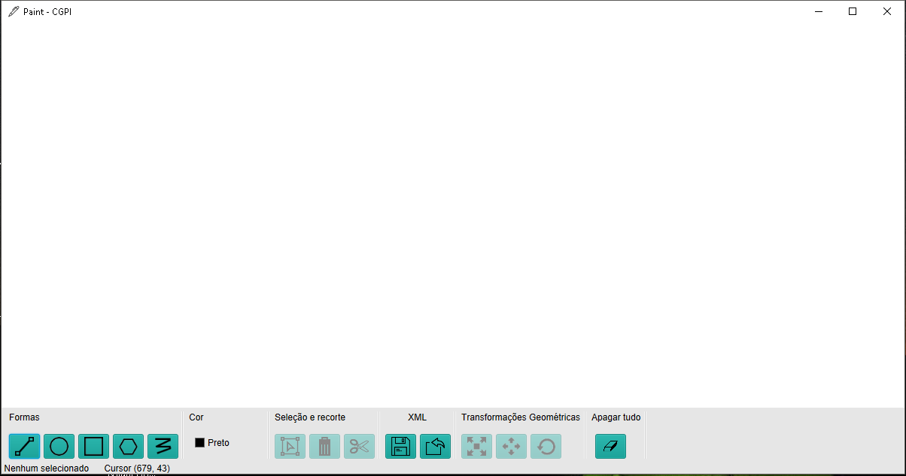

# Paint - Computação Gráfica	

Projeto do desenhador e manipulador de figuras geométricas 2D

### Prerequisites
```
Java8
JavaFx JAR
```
## Authors

* **Marcos Vinicius** - (https://github.com/marcosvgj)

## Imagem da aplicação



## Download da ferramenta 

https://github.com/marcosvgj/PaintCGPI/blob/master/Paint.jar

## TODO

* Acrescentar dependências via pom.xml (Maven) 


